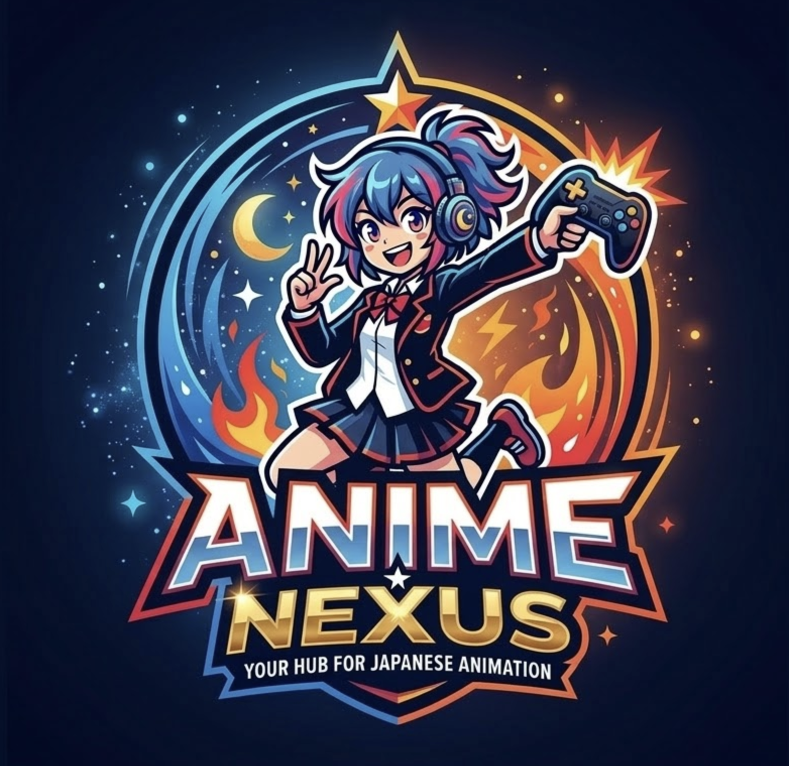

<p align="center">
  
</p>

<h1 align="center">Anime Nexus</h1>

<p align="center">A full-stack anime and drama streaming app built with Laravel 12, React 19, Inertia.js, and TypeScript. Browse, search, and stream content with watch progress tracking, watchlist management, and history.</p>

<p align="center">
  
  
  
  
  
</p>

---

## Features

**Anime**
- Browse trending, popular, and recently updated anime
- Search by title and filter by genre
- Stream episodes with HLS video player (ArtPlayer) — subtitle support, intro/outro skip, auto-advance
- Multi-provider fallback: animekai, hianime, gogoanime

**Drama**
- Browse trending dramas (TV series and movies)
- Season selector and episode navigation
- Stream via embedded player with TMDB ID mapping

**Shared**
- Watch progress tracking (auto-saves every 30s, resumes on reload)
- Watchlist management (watching, plan to watch, completed, dropped)
- Watch history with "Continue Watching" on home pages
- Content type switcher (Anime | Drama) in navigation
- User authentication (register, login, profile management)
- Dark theme UI

## Tech Stack

| Layer | Technology |
|-------|-----------|
| Backend | Laravel 12, PHP 8.4+, SQLite |
| Frontend | React 19, TypeScript (strict), Tailwind CSS |
| Bridge | Inertia.js v2 |
| Video | ArtPlayer + hls.js (anime), iframe embeds (drama) |
| Content API | [Consumet API](https://github.com/consumet/api.consumet.org) (self-hosted) |
| Auth | Laravel Breeze + Sanctum |
| Testing | Pest |
| Code Quality | PHPStan (level 9), Pint, Rector |

## Requirements

- PHP 8.4+
- Composer
- Node.js 20+
- Docker (for Consumet API)
- [Laravel Herd](https://herd.laravel.com/) (recommended) or `php artisan serve`

## Setup

```bash
# Clone the repository
git clone https://github.com/kennethsolomon/watch-anime.git
cd watch-anime

# Install dependencies
composer install
npm install

# Environment
cp .env.example .env
php artisan key:generate

# Database
php artisan migrate

# Start Consumet API
docker compose up -d

# Development server
composer run dev
```

Visit `http://localhost:8000` (or your Herd domain).

## Environment Variables

| Variable | Description | Default |
|----------|-------------|---------|
| `CONSUMET_API_URL` | Self-hosted Consumet API URL | `http://localhost:3000` |
| `DB_CONNECTION` | Database driver | `sqlite` |
| `CACHE_STORE` | Cache backend | `database` |

## Architecture

All business logic lives in **Action classes** (`app/Actions/`), keeping controllers thin:

```
app/Actions/
├── Anime/       # GetTrending, SearchAnime, GetAnimeDetail, GetStreamingLinks
├── Drama/       # GetDramaTrending, SearchDrama, GetDramaDetail, GetDramaStreamingLinks
├── History/     # GetWatchHistory, SaveWatchProgress
└── Watchlist/   # AddToWatchlist, UpdateWatchlistStatus, RemoveFromWatchlist
```

The **ConsumetService** handles all external API calls with:
- Response caching (24h metadata, 6h episodes, 30m streams)
- Stale cache fallback when the API is unavailable
- Automatic provider rotation on failure

### Routes

| Method | Path | Description |
|--------|------|-------------|
| GET | `/` | Anime homepage (trending, popular, recent) |
| GET | `/search` | Anime search results |
| GET | `/genre/{genre}` | Anime by genre |
| GET | `/anime/{id}` | Anime detail with episodes |
| GET | `/anime/{id}/watch` | Anime video player |
| GET | `/drama` | Drama homepage |
| GET | `/drama/search` | Drama search results |
| GET | `/drama/{id}` | Drama detail with seasons |
| GET | `/drama/{id}/watch` | Drama video player |
| GET | `/watchlist` | User watchlist (auth required) |
| GET | `/history` | Watch history (auth required) |

## Development

```bash
# Format PHP
vendor/bin/pint

# Static analysis
vendor/bin/phpstan analyse --memory-limit=512M

# Refactoring suggestions
vendor/bin/rector --dry-run

# Run tests
./vendor/bin/pest

# TypeScript check
npx tsc --noEmit

# Build frontend for production
npm run build
```

## Known Limitations

- **Drama streaming providers**: FlixHQ/Goku endpoints are intermittently blocked by Cloudflare. Iframe embeds via vidsrc.cc are used as a fallback.
- **Embed player ads**: Free embed providers include ads. A browser ad blocker (uBlock Origin) is recommended.

## Contributing

See [CONTRIBUTING.md](CONTRIBUTING.md) for guidelines.

## License

[MIT](LICENSE)
